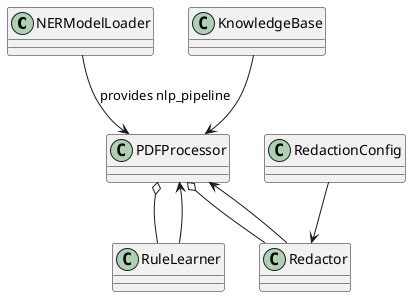
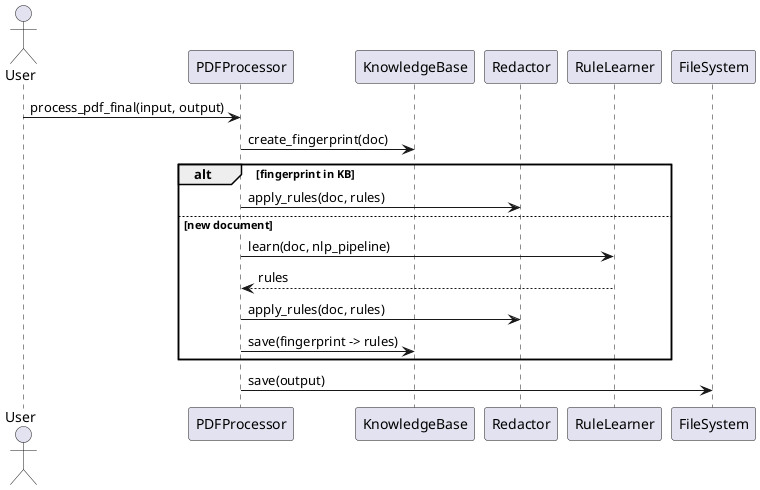

# Technical Documentation for PDF Contract Masking

This document describes the refactor of [`src/pdf_contract_masking/contract_masking.py`](src/pdf_contract_masking/contract_masking.py:1) into classes in [`src/pdf_contract_masking/contract_masking_refactored.py`](src/pdf_contract_masking/contract_masking_refactored.py:1).

## Goals
- Split procedural code into cohesive classes (≤200 lines/class, ≤20 lines/method).
- Preserve original behavior (learning rules, applying redactions, KB persistence).

## Files
- [`src/pdf_contract_masking/contract_masking.py`](src/pdf_contract_masking/contract_masking.py:1)
- [`src/pdf_contract_masking/contract_masking_refactored.py`](src/pdf_contract_masking/contract_masking_refactored.py:1)

## Class Diagram (PlantUML)


## Sequence Diagram: process_pdf_final


## Class Responsibilities
- NERModelLoader
  - Load HuggingFace tokenizer/model and create NER pipeline.
- RedactionConfig
  - Load redaction policy (left/right keep counts) from JSON.
- KnowledgeBase
  - Load/save learned rules to JSON, compute document fingerprint, sanitize anchors.
- RuleLearner
  - Inspect PDF pages, optionally run NER, extract anchors and patterns, return rules list.
- Redactor
  - Apply rule list to a PDF, draw black boxes, add overlay text, compute per-character redact rects.
- PDFProcessor
  - Orchestrate pipeline: open PDF, choose KB vs learning, call Redactor, save results.

## Method Summaries (important methods <= 20 LOC)
- NERModelLoader.load()
- RedactionConfig.get_keep(kind)
- KnowledgeBase.load(), save(), create_fingerprint(), sanitize_anchor_text()
- RuleLearner.learn(doc, nlp_pipeline)
- Redactor.apply_rules(doc, rules, nlp_pipeline)
- PDFProcessor.process_pdf_final(input_pdf, output_pdf)

## Mapping from original functions to new classes
- load_ner_model() -> NERModelLoader.load()
- load_redaction_config() -> RedactionConfig._load() (access via get_keep)
- load_knowledge_base()/save_knowledge_base() -> KnowledgeBase.load()/save()
- learn_customer_rules_with_ai() -> RuleLearner.learn()
- apply_rules() -> Redactor.apply_rules()
- process_pdf_final() -> PDFProcessor.process_pdf_final()

## Extensibility Notes
- To change NER model, instantiate NERModelLoader(model_name="...").
- To change redaction policy, edit `redaction_config.json` or use RedactionConfig(path=...).
- RuleLearner and Redactor are independent and can be swapped for improved heuristics or ML components.

## Quick usage
```python
from pdf_contract_masking.contract_masking_refactored import (
    NERModelLoader, RedactionConfig, KnowledgeBase, PDFProcessor
)
nlp = NERModelLoader().load()  # or None in RULES_ONLY mode
kb = KnowledgeBase()
cfg = RedactionConfig()
proc = PDFProcessor(cfg, kb, nlp_pipeline=nlp)
proc.process_pdf_final("contract/sample1.pdf", "hop_dong_da_che_AI_Final/che_sample1.pdf")
kb.save()
```

## Testing & Next steps
- Run existing test suite (pytest) to ensure parity with original behavior.
- Consider adding unit tests for RuleLearner and Redactor with synthetic PDFs.

End of document.